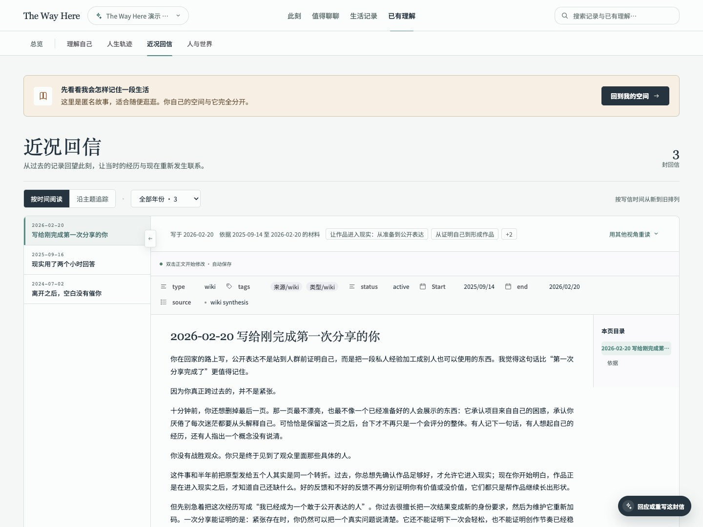
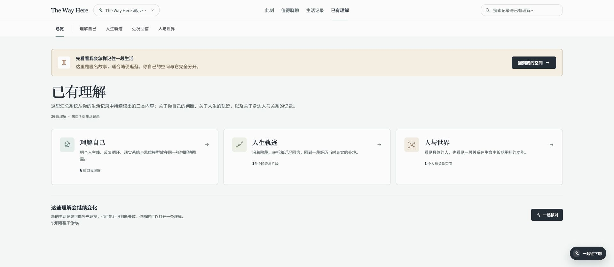

# The Way Here

> The Way Here 想成为一个会记得你的来时路、越聊越懂你的朋友。

## 项目定位

如果你一直在写日记，可能已经攒下了很多年的生活。可写完之后，很少有时间回头翻。遇到熟悉的烦恼，想知道上一次是怎么走过来的，或是想看看这些年自己到底变了多少，答案也许就在那些记录里，只是不容易找到。

如果你不写日记，也可能常常觉得，有些日子值得留下，却不知道从哪里写起。认真写一篇太费劲，拖到有空时，细节已经忘了。手机里有照片，聊天里有当时的心情，但少了几句自己的话，后来再看，也未必记得那天为什么开心、又为什么难过。

The Way Here 想让这两件事都容易一点：已经写下的生活，在需要时能找回来；还没写下的生活，聊几句也能留下。你可以带进过去的日记和聊天记录，也可以从一张照片、今天发生的一件小事开始，不必先养成每天写日记的习惯。

它会把你的经历、关系和反复在意的事整理起来，带进之后的聊天。比如你说“最近又想换工作了”，它能找到上一次的记录，陪你看看当时的困扰和这次有什么不同。聊得越多，它越能理解你眼前的处境，也帮你看见自己一路的变化。


### 不知道聊什么，就从一个问题开始

有时想说点什么，却不知道从哪儿说起。首页会根据你最近的记录问一个具体的问题；“值得聊聊”里还有一些可以接着聊的事，挑一个有感觉的就好。

可能是上次提过、还没说完的烦恼，也可能是最近生活里的一点变化。点开就能聊，不用重新交代一遍背景。


### 近况回信：读过你的生活，再写信给你

写了很多心事之后，你也许会想听听回应。“近况回信”会结合一段时间的记录和对你的了解，写一封信给你：聊聊你最近在为什么费心，有什么变化，也说说这些事和过去的你有什么联系。

你可以按年份翻信，也可以沿着工作、关系等主题往回看。想换个角度想想，还可以用其他视角重读，或直接回应这封信，接着聊下去。



### 把散落的生活记录放在一起

日记、笔记、AI 对话、微信记录和消费账单，都可以放进来，按来源和月份查找。想重读某一天，就打开当时的完整记录。

这些材料也会用在之后的聊天和回信里。过去写下的一句话，可能刚好能帮你想清楚今天的一件事。


### 看看这些年，自己是怎么走过来的

“已有理解”会整理你走过的人生阶段、身边重要的人，以及从记录中慢慢看出来的习惯和在意的事。你可以顺着时间回看，也可以单独看看一段关系是怎么变化的。

新的经历会继续补充进来。看到哪里想多说几句，就从右下角打开聊天，它会带着当前页面的内容和你聊。



## 记录保存在自己的电脑里

日记、对话和整理出的内容默认保存在本机，公开仓库里只有匿名演示材料。使用 AI 时，对话和所需的相关记录会发送给你配置的模型服务。

目前适合一个人在自己的电脑上使用，没有账号和多用户功能，服务只监听 `127.0.0.1`。如需远程部署，要先补齐认证、TLS、CSRF 防护和运行沙箱。

## 快速启动

仓库自带一套匿名演示记录。启动后就能翻翻日记、看看回信，试着聊几句，再决定要不要放入自己的材料。

环境要求：

- macOS、Linux 或 Windows WSL（在 WSL 的 Linux 终端运行）
- 首次准备环境需要联网；系统需提供 Bash、tar、curl 或 wget，以及 shasum 或 sha256sum
- 已安装的 Node.js 22.19+、Python 3.9+ 和项目指定版本的 pnpm 会直接复用；缺少时自动安装到 `studio/.runtime/`，无需管理员权限
- 自动下载 Node.js 支持 x64 / ARM64；Linux 与 WSL 需要可运行官方 Node.js 二进制的 glibc 环境（例如 Ubuntu 22.04+）
- 使用 AI 对话时，需要可用的 Codex CLI，或在配置中提供 Pi 模型服务

克隆或下载仓库后，在项目根目录运行：

```bash
bash start.sh
```

脚本会自动检查环境、补齐依赖并构建前后端。使用 `bash start.sh` 也适用于下载 ZIP 后没有执行权限的情况。启动完成后，打开 <http://127.0.0.1:4321>；按 `Ctrl+C` 可以停止服务。

首次启动会校验并记录安装状态。后续启动中，依赖清单和运行环境未变化、依赖仍完整时跳过安装；源码、构建配置和产物未变化时也跳过构建。需要补包时优先复用已有下载缓存。Python 和 pnpm 已安装的可用版本同样不会重复下载。

若需要主动重新检查依赖或重新构建，可以分别使用 `bash start.sh --reinstall`（同时重新构建）和 `bash start.sh --rebuild`。失败后可直接重试，只有成功的步骤会记录为可复用状态。端口被占用时会提前报错，可通过 `--port` 改用其他端口。

全新下载默认打开随仓库提供的 demo；当已注册的个人库目录实际存在时优先打开个人库。也可以用 `--knowledge-base` 明确指定。

项目依赖与首次安装 pnpm 都使用公网源 `https://registry.npmjs.org/`。启动脚本会覆盖当前 shell 中的 npm/pnpm 源配置，避免继承公司内网源；不会修改系统或用户级配置。

指定端口：

```bash
bash start.sh --port 8080
```

想开始记录自己的生活时，从演示页提示或左上角入口创建个人空间即可。新空间是空的，和演示记录分开保存。

也可以在 `the-way-here.config.yaml` 中登记已有知识库目录：

```yaml
knowledgeBases:
  personal:
    name: "My private Wiki"
    paths:
      wiki: "vault/personal/wiki"
      sources: "vault/personal/sources"
```

`vault/personal/` 已被 Git 忽略。自己的日记、聊天记录和密钥等私人内容，请留在本机，不要提交到公开仓库。

需要临时指定空间时，可以运行：

```bash
bash start.sh --knowledge-base personal
```

也可以打开另一套完整工作区：

```bash
bash start.sh --vault /absolute/path/to/your-workspace --knowledge-base personal
```

该工作区需要有自己的 `the-way-here.config.yaml`，其中配置的路径都必须在该工作区内。

## 开发与验证

如果你想参与开发，可以从 `studio/` 启动前后端开发环境：

```bash
cd studio
pnpm install
pnpm dev -- --vault .. --knowledge-base demo
```

提交改动前运行：

```bash
pnpm typecheck
pnpm test
pnpm build
```

修改 Wiki、Skills 或维护工具时，还应在项目根目录运行对应质量门：

```bash
THE_WAY_HERE_KNOWLEDGE_BASE=demo python3 knowledge-engine/tools/update_obsidian_tags.py
THE_WAY_HERE_KNOWLEDGE_BASE=demo python3 knowledge-engine/tools/update_obsidian_tags.py
THE_WAY_HERE_KNOWLEDGE_BASE=demo python3 knowledge-engine/tools/validate_wiki_links.py
THE_WAY_HERE_KNOWLEDGE_BASE=demo python3 knowledge-engine/tools/validate_skill_system.py
```

第二次标签更新应报告 `updated=0`，链接检查应报告 `missing=0 ambiguous=0`。

## 目录结构

```text
the-way-here/
├── the-way-here.config.yaml     # 知识库注册与运行时配置
├── start.sh                     # 一键启动入口
├── knowledge-engine/            # 共享 Skills、路由与质量工具
├── studio/                      # Web 产品、API 服务与 Agent 编排
├── vault/
│   └── demo/                    # 可公开的匿名来源与 Wiki 示例
└── docs/images/                 # README 使用的匿名产品截图
```

项目采用 [MIT License](LICENSE)。
