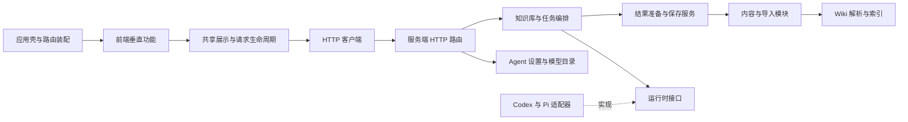

# Architecture

## 原目录连接与应用管理内容

知识库分为只读原目录和工作区内生成内容两层。新库的 `paths.wiki` / `paths.sources` 为 `app/<id>/wiki` / `app/<id>/sources`；旧 `vault/<id>` 库继续兼容，未执行隐式搬移。`paths.*` 仍全部为工作区相对路径。

每个库可显式登记 `sourceConnections: [{ id, name, path, autoBuild }]`，其中 `path` 是注册时经 realpath 校验的外部目录；它只构成读取能力，不加入任何写入根。注册拒绝与工作区互相包含的目录及重复/重叠连接。服务器端校验所有连接操作的知识库 ID，配置变更复用知识库串行写队列。

`runtime/source-connections.ts` 编排目录监听、版本检测、持久队列与 RunCoordinator。它只写 `sources/.connections/<id>.json` 状态和 `sources/外部来源/<id>/**/*.source.md` 引用；引用包含原路径、SHA-256 和可用状态，不保存正文。来源引用不参与 Agent 文件快照和差异归因，避免把后台同步误报为 Agent 修改。引用文件使既有 Wiki 链接及质量工具仍有稳定的可验证目标。同内容改名保留引用路径；删除保留失效引用。

`wiki-core/external-sources.ts` 只解引用已登记连接中的引用，校验实际路径和文件大小，拒绝符号链接越界。索引、Reader、全文搜索与 Pi read_file 使用原正文；PageWriter 和 Pi write_file 拒绝编辑引用。Codex 在存在外部连接时显式使用工作区写入沙箱，禁用外部写入升级，原目录不属于可写范围。生成任务遵循公共 Skill，产品层不复制知识判断规则。

连接监听覆盖各库，合并短时间文件变动。自动构建按库互斥，Run 保留原来的配置快照；完成时只清除与任务开始时版本相同的待更新项。失败保留队列并等待重试，目录离线不批量误判删除。界面切换活动库不会改变后台任务归属。关闭应用停止监听，重启重新比对原目录，不依赖进程中的临时状态。

照片、账单与显式一次性上传继续使用原有 ImportStore 缓存和确认流程。外部引用不会自动迁移、覆盖或清理历史导入副本。


## macOS 桌面架构（2026-09）

```text
apps/desktop
  主进程：窗口、菜单、状态项、通知、系统权限、工作区选择
  preload：隔离的少量 IPC 方法（不向页面提供文件系统或 Node）
  native/SpeechCapture.swift：用户主动触发的系统语音识别
        │ authenticated loopback HTTP + SSE
apps/server（Electron utilityProcess 托管，动态端口）
  HTTP 运行时校验 / 内容与导入 / 知识库编排 / Agent 与 Run
        │
  wiki-core / life-views / run-manager / codex-bridge / shared
        │
  持久化知识空间（自动创建或已选择的旧空间）

apps/web
  app/AppShell：窗口导航、路由、知识库生命周期
  features/desktop：命令面板、偏好设置、随手记、语音、通知、窗口桥接
  InspectorProvider + PageAgentContext：页面发布上下文
  AgentDock：窗口中唯一的会话界面，保留任务、审批与差异能力
  shared/voice-input：低层输入组件的可注入语音插槽
```

桌面宿主不实现知识判断、不读取或改写笔记。Web 页面只通过本地 API 访问内容。原有领域 package 职责保持不变；迁移主要发生在运行宿主、应用组合层、共享交互和呈现层。

生产依赖由 `scripts/package-server.mjs` 从已安装依赖图物化，保留各版本及许可证，排除工作区源码、私人库和开发依赖。桌面构建通过白名单打包 app、web、server 与原生辅助程序；知识引擎、Python 校验环境和原 Web 演示库随包提供，用户数据保存在应用包之外。应用仅监听 `127.0.0.1` 动态端口；桌面模式要求进程随机会话令牌，界面使用按工作区散列确定的稳定 `https://workspace-….localhost` origin，Electron 协议处理器转发到动态端口并添加令牌；外部 HTTPS 请求不携带令牌。由此 localStorage 与 IndexedDB 在重启后保持原有空间，照片草稿、随手记与偏好不会因端口变化丢失。渲染进程启用 sandbox、contextIsolation，禁用 nodeIntegration；IPC 校验来源与本地路由，外链只允许 http/https/mailto。

现有 Agent Run 的知识库与配置快照继续决定 Prompt、审批、验证与差异。新增 `POST /api/capture` 验证显式知识库 ID，绑定当时的索引与导入清单，首次写入即包含完整确认正文，使用排他创建避免覆盖同名记录。页面 API 对内容写入携带首次加载的知识库 ID；切库后服务端拒绝旧窗口内容写入，窗口刷新以清除过期页面上下文。随手记草稿按库存储。

各页面通过 `PageAgentContext` 发布上下文，卸载时释放；`AgentDock` 由 Shell 或独立对话窗口挂载，旧浮动入口、模态遮罩、Tab 陷阱和内嵌设置弹层已删除；关闭 Inspector 只隐藏而不销毁会话。独立深聊窗口通过当前 Run ID 恢复对话；独立阅读窗口使用 ReadOnlyDocument。内容、侧栏和 Inspector 分别滚动，Markdown 目录与编辑位置改为跟随内容滚动容器。

语音遵循录音、原话、整理、确认四步；共享控件依赖可注入的语音插槽，避免 shared 反向依赖 feature。偏好设置复用原有 AI 全局配置服务。桌面主窗口订阅 Run 和预测任务事件，并在 SSE 重连时对 Run 列表补齐状态；旧任务初始静默，完成或失败后将模块标签与任务入口交给 Electron 主进程，由主进程在所有产品窗口均未聚焦时才显示系统通知。通知偏好保存在本机，Dock 不显示任务数量；值得聊聊不再有独立消息提醒。更多操作与验收见 [DESKTOP.md](DESKTOP.md)。

以下章节记录保留的领域与数据能力。


## 工作区与知识库模型

```text
Project Workspace（用户拥有）
  ├─ AGENTS.md：顶层协作边界与一级分发
  ├─ the-way-here.config.yaml：知识库注册、共享路径与质量门
  ├─ vault/
  │   ├─ personal/：私人原始知识 + Wiki
  │   └─ demo/：匿名演示原始知识 + Wiki
  ├─ knowledge-engine/
  │   ├─ skills/：全部知识库共享的构建规则
  │   └─ tools/：公共质量与维护工具
  └─ studio/
      ├─ wiki-core：配置、Markdown、frontmatter、链接、搜索索引
      ├─ life-views：今天、阶段地图、人物、关系、回信、状态信号与“值得聊聊”问题池
      ├─ codex-bridge：Codex app-server JSONL 协议
      ├─ run-manager：任务、快照、差异、审批和验证记录
      ├─ server：本地 API、Agent 运行时、文件监控、SSE、静态页面与任务编排服务
      ├─ web：阅读、探索、编辑和任务工作台
      └─ AGENTS.md：仅适用于 Studio 的工程协作协议
```

Studio 不把知识构建规则重新写进 TypeScript。它提供编排、展示和安全边界；归档判断由根 `AGENTS.md`、Skill 注册表与 `knowledge-engine/skills/` 决定。启动时从配置选择知识库：显式指定的 ID 优先；未指定时优先打开已注册的非 `demo` 知识库，只有不存在个人库时才进入演示库。索引、编辑和运行记录只作用于该库声明的内容路径；Skills 与工具不复制到各库。

## 一键启动与本地缓存

根 `start.sh` 用 Bash 调用 Studio 启动入口，支持 macOS、Linux 和 Windows WSL。工作区参数相对调用者目录解析；端口与启动锁在安装依赖之前检查。Node.js 不可用时下载并校验官方安装包；Python 不可用时由 uv 准备项目本地 Python；pnpm 版本从 `package.json` 的 `packageManager` 读取。运行环境、Python 包和状态标记只保存在忽略提交的 `studio/.runtime/`，npm 与 pnpm 使用公网源且不修改用户的全局配置。

`startup-cache.mjs` 分别保存依赖和构建指纹。依赖复用要求各工作区清单、锁文件、安装配置、Node 版本、系统架构与项目路径一致，同时检查已安装锁文件、直接依赖和工具入口。依赖不完整或指纹改变时运行冻结锁文件安装，优先复用下载缓存；只有安装成功才保存状态。构建复用检查源码、配置、`VITE_*` 环境变量与前后端产物清单；构建失败不会留下成功标记。`--reinstall` 重新校验依赖并构建，`--rebuild` 只强制构建。

启动器用 `startup-check.mjs` 选择知识库并将 ID 显式传给服务端：未指定时只在 Wiki 与来源目录实际存在的注册库中选择，优先个人库，否则 demo。这样公开下载不会因为保留了私人库配置而创建并打开空私人库。显式 ID 仍可用于初始化已注册的新空间；配置文件与服务端原有的知识库解析契约保持一致，运行任务继续固定绑定所选 ID。

## 数据流

1. 启动时读取根注册表，优先选择显式指定或已注册的个人知识库，只在没有个人库时使用演示库，并只索引所选库的 Wiki 与来源 Markdown。
2. 浏览器通过本地 API 读取摘要、页面、搜索和派生视图。
3. 文件监控发现改动后重新索引，并通过 SSE 通知界面刷新。SSE 订阅随响应连接关闭而释放，不随请求读取结束释放；界面在连接建立或重连、恢复可见及重新获得焦点时重新读取状态，补回断线期间遗漏的任务完成通知。
4. 页面内统一的上下文 Agent 抽屉创建任务；Run 固化 `knowledgeBaseId` 与配置快照。页面 Agent 使用 `auto` 模式，根据用户原话识别读写意图，并预先记录受保护目录快照以便安全收集可能发生的改动。
5. `AgentRuntimeRegistry` 按用户选择与配置解析 Codex 或 Pi，适配器把两者事件统一为消息、工具、审批、诊断和回合完成事件；审批请求停在界面等待用户决定。
6. 回合完成后按 Run 绑定的知识库收集差异；只有实际发生改动时才运行质量门并重建索引。显式写入与 `auto` 任务按知识库串行化，不同知识库可以独立运行；重启时会从对应运行时的会话记录恢复状态。

生活记录以 Markdown 文件名作为唯一标题，索引与界面都不再从正文 H1 推导来源标题。新建记录生成空正文；旧记录开头已有的 H1 在阅读和编辑时作为兼容标题隐藏，保存正文时原样保留，因此不会静默批量改写既有文件。

聊天记录导入由 `modules/imports/chat` 的单一深模块承担。外部接口只接收已解包的导出文件、平台渠道与导入时间，内部注册表将格式分派给 Claude、ChatGPT 或通用 JSON Adapter，再统一完成格式过滤、会话规范化、Markdown 渲染、文件名去重和大小检查。Claude Adapter 只选择官方导出包中的 `conversations.json`，按会话拆分可见消息，忽略 thinking 与工具协议块，并把缺失的附件实体明确保留为引用；`users.json` 与 `memories.json` 不会默认进入知识来源。索引摘要会暴露经过白名单校验的 `import_channel`，因此界面按持久化来源元数据区分 AI 对话、普通文件与账单，不依赖用户选择的保存目录。新增平台格式只增加 Adapter 和注册项，不修改来源存储与后续构建流程。

消费账单走同一来源导入 seam，但由后端的账单深模块处理平台格式。模块以一份平台导出文件为接口，内部完成编码识别、交易规范化、退款归并，以及重复商户、共同地点、异地旅程、单日复合活动和跨日期主题聚类；输出一份 UTF-8 原始 CSV、一份可索引的 Markdown 消费旅程报告和前端可展示的旅程摘要。每条候选线索带有账单事实复述、置信度、证据和轻量关联，并在导入清单中保存独立的待处理、已确认、已简答、已细聊或已跳过状态。报告内只有“已确认的消费旅程”是应用与对话可更新的受管区，聚类与规范化交易保持为可追溯证据。

消费旅程采用显式两阶段协议。丰富阶段使用严格只读 Run：Agent 可以读取报告并检索现有 Wiki 作为背景，但不能修改 Wiki 或其他文件；每轮末尾返回结构化 `journey-report` 结果，由服务端校验导入批次和来源路径后原子写回报告受管区，并把结构化负载从对话展示中隐藏。结果目标保存任务开始时的报告内容哈希，若对话期间报告被手工或并发修改则拒绝覆盖。丰富提示不要求每轮提问，并把“不记得、没什么或不想展开”视为有效边界；用户通过“这段先聊到这里”发起一个同会话收尾 Run，该轮只确认保存结果、不再追问。报告更新后状态变为“可构建”，只有用户明确选择“构建这份记录”才启动独立写入 Run，按 `build-wiki` 路由摄取已确认叙述并运行质量门。构建后继续对话会再次更新报告并回到“可构建”，不会自动重建 Wiki。

来源构建清单同时保存每份可索引记录的冷启构建状态：导入材料按内容判定直接构建、对话丰富或待确认；界面中新建的 Markdown 记录也会登记为可直接构建，因此重新打开页面后仍保留“构建这份记录”入口。来源重命名时同步迁移构建清单中的路径，保留构建状态与任务关联，并在索引刷新前通知清单更新；迁移失败时恢复原文件名。照片与账单共享生活记录页顶部的待完成记忆卡片；仅本次导入成功事件会自动打开对应记忆弹窗，之后刷新或重新进入只展示卡片，不重复打断用户。账单线索通过带版本号的清单更新实现并发保护；确认和简答会确定性重建报告受管区，深聊 Run 的 `journey-report` 目标额外绑定 `clueId` 并在完成后回存摘要、Run 与轮次数。只有全部线索都有归属且至少一条被保留时，账单报告才进入可构建状态；前端与 `RunCoordinator` 都执行该门槛。状态与 Run 通过 `sourceContext.operation` 区分 `enrich` 和 `build`；单条构建记录一个 `storedPath`，批量构建记录用户实际勾选的 `storedPaths`。关联页来自构建 Run 的真实差异，不由前端猜测。用户选择“稍后再说”会持久化并停止重复展示普通导入确认卡。原始 CSV 与普通原始材料正文不会被冷启流程改写。

冷启 direct 运行显式进入 `build-wiki` 的冷启配方，除综合理解外还检查“值得聊聊”和代表性近况回信。导入完成状态以 Agent 已结束且确有持久化变更为准；若内容已经落盘但后续质量门失败，来源不会退回成完全未处理，界面保留质量提醒和真实 Run 供追踪。

“值得聊聊”遵循同样的知识边界：`build-state-tracking` 在 Wiki 中维护带有当前理解、提问时机、仍然未知和相关知识链接的问题池；`life-views` 只做确定性解析并通过 `TodayView.conversationPrompts` 暴露给产品。前端以按日期稳定的加权顺序展示，不在 TypeScript 中复制问题生成判断，也不会因一次刷新改变用户正在阅读的内容。状态信号仍独立服务证据工作区，不与对话问题混成同一个模型。

## Agent 运行时

### 照片记忆冷启

生活记录页用紧凑缩略卡片展示待完成的照片与账单记忆；列表右侧继续呈现原有 Markdown 来源正文，不挂载照片编辑工作区或启动人脸检测，也不在账单正文头部重复渲染记忆入口。卡片以最新导入清单状态为准，已构建或已暂缓的记忆退出顶部区域；刚导入的本机快照只补齐刷新前缺少的批次，不覆盖服务端状态。导入列表响应会排除来源文件已经不存在的条目，空批次不再返回；历史清单与隐藏原图继续保留。删除文件或文件夹成功后，浏览器立即同步移除待完成卡片、待构建计数和打开的记忆，再等待服务端刷新；刚导入的快照一旦被服务端接收便停止补齐，防止删除后从旧缓存重新出现。完整列表仍保留“打开照片记忆 / 打开账单记忆”入口；显式点击后在原生模态对话框加载详情，照片沿用人物与讲述流程，账单进入线索卡片墙。账单清单为每条线索保存结构化交易证据；展开时只渲染前三笔单行摘要，其余笔数折叠，悬停和键盘聚焦都能读取完整交易字段。确认、简答、跳过和重新处理都在卡片原位完成；“展开细聊”把单条线索交接给 Agent 抽屉，页面右下角原有的通用对话入口始终保留。发起 Agent 对话时关闭记忆弹窗并交接焦点，避免叠加模态窗口。页面或文件切换只静默恢复关联会话，只有主动点击对话入口或触发 `open-context-agent` 才打开窗口。

`PhotoMemoryStore` 统一管理照片二进制、人物框、逐照片故事和确认稿。`POST /api/imports/photos` 接收显式知识库 ID，整批验证后在该库来源目录的 `.photo-memories/<id>/` 保存原图、自动转正且去除元数据的 JPEG 预览副本与版本化 `memory.json`；可索引的 Markdown 报告、导入清单沿用现有来源入口。第一版每批 1–10 张 JPG/PNG/WebP，服务端单张 20 MB、合计 100 MB、解码最多 5000 万像素，不接收动画及 HEIC。浏览器允许选择单张不超过 100 MB 的照片；超过 20 MB 时逐张通过独立 Worker 压缩为最长边 2560px、质量 0.85 的 JPEG 后再预览及上传。压缩有 60 秒超时和取消清理，失败按文件提示，保存的是压缩副本，电脑原文件不变。

照片导入仍沿用“选照片 / 命名与位置”，导入后的记忆标注统一为“认人 / 讲故事”两步。顶部两段导航与底部上一步、下一步保持一致；“跳过这步”允许保留未命名候选。“收进理解”保存用户确认稿后直接启动原有构建与质量门，无额外核对或构建页面；运行中显示状态，失败保留内容供重试，完成显示人物图谱入口。

照片工作区进入认人物阶段后，浏览器 Worker 默认按批次逐张使用随应用分发的 MediaPipe WASM 与 BlazeFace full-range 模型本地检测人脸，不访问 CDN。每张照片先检测整图；长宽比超过 1.15 时再沿长边检测两块 64% 的重叠区域，使合照中的小脸获得更高有效分辨率。置信度门槛为 0.35，整图与分块结果按人脸框交并比去重，只保留置信度更高者。同一批次串行复用一个 Worker 和模型，整批完成或取消后释放；单张失败或超时会销毁异常 Worker，再为后续照片重新初始化。Worker 上报准备、定位和分组阶段及照片序号；定位限时 30 秒，首次收到人脸框后为分组单独计时 15 秒。分组超时或崩溃保留已经返回的人脸框，销毁异常线程并让本批后续照片跳过特征加载，避免重复等待。检测运行状态由实际批次生命周期驱动。每张解码位图和分块位图处理后立即释放，全部已标注或已取消的批次不创建 Worker。检测期间允许切换照片和进入讲故事，批次分组完成后开放人物编辑，避免过早认领漏掉尚未检测的同组照片；单张失败可重试，关闭批次时终止检测；已有标注和本机草稿（含主动清空的人物列表）不被覆盖。检测只定位人脸，不直接识别姓名；多张照片时，在同一个 Worker 中加载本地 SFace / ONNX WASM 特征模型，以双眼、鼻尖和嘴中心对齐至 112px。分块检测的关键点先映射回原图坐标，再参与特征计算。特征只留在批次内存，计算完成后清除；候选分组保存成员 ID 到本机草稿；确认时将组 ID 写入 `PhotoPerson.groupId`，使再次打开、改名、重选人物仍可同步组员，不上传特征或写入 Wiki。分组采用完整链接、余弦相似度至少 0.6，禁止同照片的人脸入同一组，低质量/小人脸不参与，特征模型失败时保留逐人确认。确认后以一次 PATCH photos 数组原子保存全部组员，共用一个版本号，服务端逐项校验并保留批次和知识库边界。用户可以直接拖动已有框、拖四角缩放、拖上下边中部单独改变高度，也可以在照片上圈出漏检人物；手动框与自动框使用同一 `PhotoPerson` 保存协议，但不参与本批次自动分组。`groupedPhotoQueue` 按照片顺序解析候选组与已保存的组，拒绝冲突身份和同照片的重复组员。界面将范围调整与人物填写拆成独立状态：点击框只选中并显示边角手柄，拖动结束后保存位置且保留选中；点击框上的姓名标签才在框附近浮出搜索表单。外部点击同时关闭表单与选中状态；浮卡内容独立滚动，不参与照片和页面布局计算。选择姓名或新称呼即一次保存同组身份，每张照片的框和人物 ID 独立保留。移出误分头像后可单独标注；“不记录这个人”仅移除当前照片中的这次标注。服务端 Sharp 从转正副本裁剪头像，避免 EXIF 方向与坐标错位。

人物和故事草稿按知识库 ID、照片批次 ID 隔离暂存在本机浏览器，先恢复再检测和保存。草稿记录人脸检测版本；检测器升级后会复检尚未写入服务端的照片，按框重合度复用已有候选 ID，并只补入新找到的人脸，避免覆盖手动框和未保存称呼。逐照片讲述存于 `photoStories` 本机覆盖层；持久化字段为 `MemoryPhoto.story` 和 `storyOrigin`（user / ai），PATCH 的 `photoStories` 逐项校验照片归属、去重、字符串类型及一万字上限。空字符串代表主动留白，不能被服务端旧稿覆盖。兼容旧 `answers` 和未发送回答；无可靠单张归属的整段旧讲述保存在 `legacyStory` 并可展开修改。过时原始回答不覆盖已编辑的整段旧稿。

讲故事展��整组照片，共用一个最长六万字的故事输入框；旧逐张故事和浏览器草稿合并恢复到该框，新的整组草稿优先，避免重复拼接。故事编辑区可点击“AI 帮你写”或结合可选背景润色，一次发送本批全部 JPEG 预览，以用户第一人称串成一篇有依据的故事；照片原图不发送。新 draft 任务省略 photoId，整篇输出保存在 memory.draft，并以 storyLayout=group 标记为权威整篇，保持未确认；旧单张任务仍兼容。任务绑定知识库与 expectedRevision，过时输出不能覆盖新内容。运行期间禁用编辑，成功后整篇回填，用户核对后点击“收进理解”才确认并构建。照片和账单回忆正文共用第一人称写作约束，不从素材虚构关系、心情、时间或因果。

照片 AI 协议为 `outputTarget.kind=photo-memory`，只保留两个实际入口。`enrich` 接收当前人物与讲述上下文，不发送图片，用于继续聊天；`draft` 绑定单个 `photoId`，只发送该照片预览和已有上下文，要求直接返回故事、不提问。结果仅写目标照片，保留其他故事，不自动确认或构建，并拒绝未知照片、已有非空故事和过时版本。两者均为只读 Run，通过 `<photo-memory>` 结果区受控保存，不允许模型写文件。Codex 桥接传递 `localImage`，Pi 传递真实 image 内容块；单张起草时如果模型目录的 `inputModalities` 不含图片会明确拒绝，不静默切换供应商。第三方服务的数据政策仍由该服务决定。

照片写作背景与 pendingDraftRunId 随浏览器草稿按知识库和照片批次隔离保存；收起、生成完成及重新打开都保留背景，明确清空也会保存。旧版丢失的背景可从同批次最近一次写作请求的结构化 background 字段恢复一次。正在等待回填的任务即使已经被完成通知标记为终态，前端仍读取并应用服务端照片草稿，成功回填后才清除待处理任务 ID；失败保留原稿。未修改的本机故事缓存不能覆盖服务端最新草稿，用户主动编辑或清空的故事仍优先保留。

AI 返回的未确认草稿只在隐藏元数据中保存，本机讲述在确认前只留在浏览器，均不写入可摄取报告。用户点击“收进理解”后，故事及用户指定的人物才写回来源；独立的 build Run 在入口检查确认状态���报告一致性，再按共享 `build-wiki` 路由处理，产品端不复制 Wiki 抽取判断。任务锁和单记忆串行版本号阻止并发旧结果覆盖，外部改过的来源报告不会被静默覆盖。路径逐级检查符号链接，图片 URL 绑定知识库 ID，服务端不接收任意本地文件路径。

第二步的“收进理解”只在有讲述且没有未保存人物修改时启用；先保存确认稿再发起构建，完成后显示已收进理解及人物图谱入口。质量门成功后才发布人物影像关联。用户明确选择的页面 ID 从选择器、保存、对话上下文一路保留到构建；输入搜索词不改变已选关联，只有明确选择才提交身份变更。无页面 ID 的称呼标记为待匹配，不再视为新人物。构建上下文携带本次照片及标注 ID、已选页面 ID、确认讲述，以及本库人物页面 ID、路径、姓名和别名。模型按用户授权结合资料判断同名、别名及“我”“自己”等称呼，确认同一人即可合并，无需二次询问；不确定时保留未决，不按外观识人。模型通过末尾 `<photo-people>` JSON 返回关联，服务端只校验照片/标注属于本批次、目标是当前库的人物页且未覆盖用户明确关联，再发布影像并回存页面 ID；未决项不发布。兼容旧模型无关联块时对本次新增页的唯一同名匹配。构建前按保存的来源哈希检查外部修改，允许旧模板报告继续构建；旧“新人物，勿与同名者自动合并”占位文字由本次构建授权明确取代，不改写历史来源。`/api/views/relationships` 在领域图谱上附加照片证据及头像 URL，不改变人物归类；列表、图谱和人物卡复用同一字段。撤销头像许可立即停止服务该头像；删除来源报告后影像不再进入人物视图。原图仍独立保留在隐藏来源目录，删除普通报告并不等于删除原图，第一版尚无整批照片的管理界面。

`RunCoordinator` 只依赖通用的 `AgentRuntimeProvider` seam，不包含 Codex 或 Pi 的协议分支。Codex 适配器继续复用 `codex-bridge`；Pi 适配器使用 `pi-agent-core` 驱动用户配置的模型，并提供限定范围的列表、搜索、读取和写入工具。只读任务没有写工具；`auto` 模式由 Agent 按当前目标、耐久价值、证据质量与影响范围判断是否更新 Wiki，不要求额外写入确认。所有写入只允许落在当前 Run 固化的 Wiki 或来源目录，已有文件还要求读取时返回的 SHA-256，避免并发覆盖；规则、目录、批量重跑或难以撤销的操作仍需先确认范围。

根 `the-way-here.config.yaml` 的 `agents` 字段负责工作区能力开关和初始值。例如：

```yaml
agents:
  defaultRuntime: auto
  runtimes:
    codex:
      enabled: true
      command: codex
      transport: stdio
    pi:
      enabled: true
      providers:
        - id: my-openai-compatible
          name: My Model Service
          protocol: openai-completions
          baseUrl: https://example.com/v1
          apiKeyEnv: MY_MODEL_API_KEY
          models:
            - id: my-model
              displayName: My Model
              reasoning: true
              contextWindow: 32768
              maxOutputTokens: 8192
```

用户实际选择保存在操作系统应用数据目录的工作区级 `agent-settings.json`，因此切换知识库或从任意 Agent 入口打开设置时都会读到同一份配置。Codex 只保存模型和思考深度；第三方模型由 Pi 执行。`third-party-provider-catalog.ts` 是厂商、官网服务地址、协议、模型枚举和模型思考能力的唯一目录，当前覆盖 DeepSeek、智谱 GLM、阿里云千问、Kimi、MiniMax、OpenAI 与 Anthropic。浏览器只读取公开的厂商/模型预设，不接触或提交服务地址；用户按厂商填写 API Key 即可。每个厂商的 Key 会分别记忆，只写入权限为 `0600` 的本机状态文件，不进入知识库、Run 配置快照、事件广播或接口响应；`GET /api/agent-settings` 只返回哪些厂商已经配置。旧版接口地址设置会在读取时迁移到匹配的厂商预设，根配置中的 provider 与 `apiKeyEnv` 仍可作为首次启动的兼容初始值。

更新全局设置后，`AgentRuntimeRegistry` 会清除运行时目录缓存，并为后续 Pi 任务换用新的模型目录；已经开始的 Agent 回合继续持有创建时的适配器，不会因设置变化而中断。

## 本地 API

- `GET /api/vault`：当前知识库、可用知识库、数量和 Agent 运行时摘要。
- `POST /api/vault`：创建与演示库隔离的个人知识库、写入注册表并切换到新库。
- `DELETE /api/vault/:knowledgeBaseId`：删除独立管理的私人知识库目录并原子更新注册表；演示库、共享/自定义目录和存在活动任务的知识库会被拒绝。
- `POST /api/vault/select`：在当前服务进程中切换活动知识库。
- `GET /api/agent-runtimes`、`GET /api/agent-models`：可用运行时、当前模型和思考深度。
- `GET /api/agent-provider-presets`：第三方厂商、模型枚举及每个模型支持的思考深度；官网服务地址不会暴露给前端。
- `GET /api/agent-settings`、`PUT /api/agent-settings`：读取或更新工作区级全局 Agent 设置；密钥字段只写不读。
- `GET /api/pages`、`GET /api/pages/*`：页面列表与正文。
- `GET /api/sources/folders`：读取当前知识库来源根目录中的可选文件夹；返回相对路径并包含空文件夹，供新建记录、导入等入口复用。
- `POST /api/sources/folders`：在来源目录或已有子目录内创建空文件夹；校验输入、隐藏目录和真实父路径，重复名称返回冲突，拒绝跨来源目录的符号链接路径。生活记录页创建后刷新目录列表。
- `DELETE /api/sources/file`、`DELETE /api/sources/folder`：删除当前知识库内的一份生活记录或一个非根文件夹；文件删除带并发检测，文件夹删除受来源根目录边界保护。
- `GET /api/search`、`GET /api/views/*`：搜索与个人成长派生视图。
- `PUT /api/pages/*`：编辑当前知识库内的 Wiki 或来源，带并发检测。
- `GET /api/events`：文件、索引、任务、审批和验证 SSE。
- `POST /api/runs` 与 `/api/runs/:id/*`：启动和控制任务；创建请求显式携带知识库 ID，支持 `auto`、只读、写入与质量检查模式。`DELETE /api/runs/:id` 删除当前知识库中该任务所属的整段对话及全部轮次，进行中的对话会被拒绝，已经物化到生活记录或 Wiki 的结果不回滚。人物视角重读可附带经过校验的 `letter-version` 结果目标，消费旅程只读对话可附带绑定导入批次与报告路径的 `journey-report` 结果目标；非法模式、目标、来源上下文和审批值在服务端拒绝。
- `GET /api/imports`、`POST /api/imports/files`、`PATCH /api/imports/:id/build-status`：读取导入批次、带入本地材料，并持久化用户对普通冷启构建邀请的选择。
- `PATCH /api/imports/:id/journey-clues/:clueId`：以导入清单版本号为并发边界，保存单条账单线索的确认、简答、细聊、跳过或重新处理状态，并同步消费旅程报告受管区。

## 运行记录

运行记录放在操作系统应用数据目录下的 `the-way-here/vaults/<workspace-hash>/`。记录包含知识库 ID、创建时配置、`runtimeId`、通用会话/回合 ID、provider、model、最终结果、用于通知来源标识的 `sourceModule`、可选的 `outputTarget`，以及发起会话时绑定的 `contextPageId`；后续轮次自动继承同一文件绑定。界面切换到某个文件时会恢复绑定到该文件的最新会话，运行中、等待审批和已结束状态使用同一恢复路径；旧版来源构建任务仍可通过 `sourceContext.storedPath` 匹配。删除历史按通用会话 ID 一次移除全部 Run；Pi 同步删除 `agent-sessions/pi/` 中的本机会话文件，已写入生活记录或 Wiki 的内容保持不变。Pi 对话也保存在该目录的 `agent-sessions/pi/`，不会直接写入知识文件。完成的人物视角重读通过 `letter-version` 目标关联到原回信；消费旅程通过 `journey-report` 目标由服务端只物化报告受管区，并记录 `outputSavedAt`。写入及 `auto` 任务的快照覆盖配置声明的根协议、Wiki、Skills、Tools 和来源。每个任务使用唯一临时文件，同一知识库内可能改写内容的任务串行执行；旧版 `threadId`/`turnId` 会按 Codex 运行时透明迁移，旧版并发写坏后仍保留首个完整 JSON 对象的记录可自动恢复。

## 代码组织与依赖方向



箭头表示依赖或调用方向，虚线表示接口实现。跨前后端的数据契约统一放在 `packages/shared`；浏览器仅通过 HTTP 访问知识，不引入 Node 或服务端包。各 package 的 `src/index.ts` 是显式公共出口，包内实现直接引用职责模块，不反向引用自己的出口。

### 共享包

- `packages/shared/src/`：按 `content`、`config`、`sources`、`photos`、`skills`、`views`、`agents`、`runs` 组织契约。`isTerminalRunStatus` 统一运行锁、来源状态与前端对话的结束状态判断。
- `packages/wiki-core/src/config.ts`：工作区注册表、路径边界及模型供应商配置的运行时校验；`page-paths.ts`：页面身份和分类；`markdown.ts`：正文、元数据、章节和链接解析；`wiki-index.ts`：文件索引、链接解析、查询和搜索。不把配置校验混进索引构建。
- `packages/life-views/src/`：`today.ts` 负责当前状态与证据工作区，`life-map.ts` 负责阶段及事件归属，`collections.ts` 负责卡片、模型、金句与回信，`relationships.ts` 负责人物及图关系。日期、表格和页面链接工具统一在 `page-utils.ts`。阶段关联在事件归属确定后只计算一次。
- `packages/run-manager/src/run-store.ts`：运行记录、按知识库隔离的写锁、审批、串行更新与旧运行记录迁移；`snapshots.ts`：快照及差异；`run-record.ts`：记录编码和兼容读取；`state-paths.ts`：操作系统状态目录。
- `packages/codex-bridge`：只封装 Codex app-server 协议，不引入产品流程。

### 服务端

- `apps/server/src/index.ts` 读取启动参数；`studio-server.ts` 是装配入口，注册路由、运行时与资源生命周期。
- `runtime/knowledge-runtime.ts` 管理索引、活动知识库、文件监听与重建。
- `runtime/run-coordinator.ts` 管理任务状态、审批、快照、验证、恢复及执行事件。它依赖 `agent-runtime/types.ts` 中的 `AgentRuntimeProvider`，不引用具体适配器或照片、账单存储。
- `services/run-outputs.ts` 统一结果目标验证、来源构建准备、只读结果保存与构建后的影像发布。每次操作显式接收 Run 绑定的配置及索引；不保存活动知识库，也不管理任务状态。
- `services/run-request.ts` 定义启动请求与应用错误；`run-policy.ts` 负责模式校验和 Prompt；`validation-runner.ts` 执行 Run 绑定的质量命令。
- `routes/agent-settings-routes.ts` 通过独立的 `AgentRuntimeSettings` 接口读取目录、保存设置和广播公开设置；不经过任务调度器。其余 `routes/` 只负责请求与响应映射。
- `modules/content/content-workspace.ts` 定义内容模块所需的索引、工作区路径和事件接口。页面写入、来源文件夹目录与导入清单依赖此接口，不依赖文件监听、运行时装配或知识库切换实现。
- `modules/content/page-writer.ts` 负责页面创建、保存、重命名、来源删除和并发安全写入；`source-folder-catalog.ts` 负责来源文件夹目录。
- `modules/knowledge-bases/knowledge-base-manager.ts` 负责隔离知识库目录和工作区注册表的原子更新。
- `modules/imports/prepare-import.ts` 是材料准备入口；`chat/` 和 `payment-statement.ts` 承担格式解析；`import-store.ts` 负责落盘、清单和任务结果对账；照片与消费旅程的内容保存分别由其专用 Store 负责。
- `modules/skills/` 只读取共享 Skill 目录，不复制知识判断规则。

### 前端

- `apps/web/src/app/` 只保留应用壳、页面路由装配和主导航。功能及共享层不反向依赖应用壳。
- `features/overview/` 按 `Today`、`KnowledgeHome`、`QuestionsHub`、`FocusWorkspace`、`GrowthHub` 组织页面；对话问题模型留在 `talking-questions.ts`。
- `features/knowledge/` 按人生地图、人物、卡片、回信、模型、搜索和阅读组织页面；共用内嵌预览由 `PagePreview.tsx` 承担。页面直接导入，不经过混合页面集合。理解分类导航留在功能目录中。
- `features/sources/` 管理生活记录、导入、照片与账单记忆；`features/collaboration/` 管理上下文 Agent、对话及设置。`AgentContext` 只在协作功能模型中定义。
- `api.ts` 是不依赖 React 的 HTTP 客户端；`shared/use-api.ts` 管理请求取消、加载与刷新状态；`shared/routing.tsx` 管理页面链接及返回上下文，`shared/categories.ts` 保存跨功能的分类展示名。
- `shared/markdown.tsx` 统一 Markdown 阅读、编辑、自动保存与章节跟踪；`shared/ui.tsx` 统一基础展示；`TruncatedTextTooltip` 通过应用壳事件委托处理实际截断的全文提示。页���只提供内容与展示变体。
- `styles/` 继续按入口声明的级联顺序加载，重构不改变布局、主题或交互流程。

### 可执行的架构检查

`apps/server/src/architecture.test.ts` 随 `pnpm test` 检查包依赖白名单、禁止跨包访问内部文件、前端反向依赖、领域模块对编排实现的依赖、运行时循环引用，以及应用与 Worker 入口之外的孤立源码。类型检查继续拒绝未使用的局部变量和参数。

匿名回归测试覆盖独立模型设置接口、结果与公开事件的密钥隔离、切换知识库后的消费旅程结果保存、并发修改拒绝、只读门槛，以及照片结果发布。HTTP 路径、共享数据字段、现有任务文件与配置格式保持兼容；本次不迁移知识内容或本机状态文件。

## 当前非目标

- 多用户、云同步和公网托管。
- 替代 Obsidian/IDE 的完整 Markdown 编辑体验。
- 在 UI 中重写个人知识抽取规则。
- 自动发布或提交 Git。


### 构建 Skill 与双链兼容

公共 `wiki-build/references/linked-sources.md` 规定解引用和稳定双链协议。维护工具通过 `knowledge-engine/tools/source_access.py` 读取原文和 `linkTarget`，不把引用元数据当证据，也不向原文写入反链。标签维护保留新来源路径并跳过系统引用；人物/日记证据脚本使用同一只读来源入口。

界面和 Python 验证器同时支持库内路径、工作区完整路径、别名、Wiki 相对路径和原目录相对路径。歧义不自动选一个目标；入链从已解析出链计算。只读及独立窗口展示解析后的 Markdown，保留章节链接。失效来源仍有稳定引用目标，链接有效与原文可用性分开检查。断链或歧义使验证器以非零状态退出，不能被构建流程当作质量门成功。

### 已安装桌面端的首次运行

Electron 的 `workspace.mjs` 负责选择持久化位置：显式开发覆盖 → 已保存的旧知识空间 → 自动创建的 userData/workspace。首次运行直接提供 `app/personal/wiki` 与 `sources`，不依赖源码仓库。数据、配置和应用包分离。知识引擎由打包脚本从根目录权威资源收集，启动时阶段性替换应用管理副本，不复制领域判断到 Studio 代码。Python 与 PyYAML 随包分发，通过本地服务 PATH 提供给现有质量命令。已保存的外部空间失效时保留原设置并提供重新选择，禁止静默回退空库。升级只更新程序和管理资源；持久化 origin 仍由真实空间路径确定。

桌面端演示内容直接从 Web 端的 `vault/demo` 打包，不从 UX 设计稿生成故事或数据。保留 Wiki、原始记录、照片、账单及隐藏附件目录，继续使用 `vault/demo` 路径以维持已有资源引用。首次启动和旧版托管空间升级会注册缺失的 demo；个人库仍为默认，已有 demo 和个人内容不覆盖。

### 运行生命周期与资源上限

桌面 `service-process.mjs` 将握手、超时、异常退出和监听器清理集中管理：仅接受 loopback HTTP 地址，60 秒未就绪会终止进程，未换行缓冲不超过 64 KiB。校验命令独立绑定 Run 的知识库，默认每条限时 120 秒，超时在 macOS/Linux 终止进程组；累计和实时输出各限制 50,000 字符，以 close 事件确认输出管道已排空。

SSE 连接绑定响应的关闭/错误事件，心跳和连接共同释放；单客户端缓冲超过 1 MiB 后断开，由浏览器重连。服务关闭会结束已接管的事件流。来源同步定时器在上次完成后再调度，避免慢扫描造成队列积压；监听错误持久化到连接状态。知识库创建、删除与连接配置更新复用同一修改队列。

## 桌面 UX v1（2026-09）

- `archive-theme.css` 是色板、字体、两级圆角和阴影的唯一 token 定义；`desktop.css` 负责桌面外壳与共用组件的最终布局。各功能样式消费 token，不重新定义品牌色。
- 共用 `AuxPanel` 保持子树挂载，收起时使用 `inert` 与 `aria-hidden`，避免隐藏控件获得焦点、切换面板丢失对话。阅读目录为 44/240px；Inspector 为 48/326px（较小窗口 290px）。
- 值得聊聊使用 Shell 的唯一 Inspector，话题卡片通过 `openLifeConversation` 恢复绑定的话题历史；筛选卡片不会改变对话上下文。聚焦工作区、独立深聊仍只挂载本地 `AgentDock`，不同时挂载全局 Inspector。Inspector 每次窗口加载默认折叠；当前对话与历史切换、收起与展开均保留草稿及任务。
- Markdown 阅读和编辑统一字体与保存入口。属性默认折叠；成功反馈短暂呈现，失败持续显示。800ms 自动保存保留版本冲突检查；只读连接与独立阅读不获取写能力。
- `PATCH /api/vault/:knowledgeBaseId` 只修改空间名称，校验 ID 与 1–40 字符名称，经知识库注册变更队列串行写入配置；临时文件替换前检查外部并发修改，不改变 ID、数据路径或 Run 配置快照。
- `POST /api/files/reveal` 接收已索引的 `pageId`，从服务器索引解析原文件；macOS 使用文件管理器定位，拒绝不可用的外部来源。不接收客户端任意绝对路径。
- 随手记为 420px 置顶工具窗口，注册全局 `CmdOrCtrl+Shift+N`，保持主窗口快捷键 `CmdOrCtrl+N`。正文和标题以知识库 ID 隔离本地暂存，300ms 延迟与离页兜底写入，保存成功清空；录音非模态，结束后将原话插入光标处，用户点击保存后才创建记录。
- AI 整理提示与每日话头是本机呈现偏好，跨窗口同步；不会切换运行时、关闭正在执行的任务或改变知识库内容规则。
- 桌面验证使用临时匿名演示知识库；测试关闭真实 AI 执行，以现有运行时、工具、审批和 Run 测试验证协议。
## 看见未来：输出结构

LifePredictionReport 不含版本号，按实际结构校验。读取时忽略遗留 version/gaps 元数据；不兼容的内容结构不展示。删除旧双树、presentationVersion、旧维度/阶段兼容、旧评分算法和截断摘录器。根只包含current、四维现状、evidence、scenarios；四维固定health/work/play/love，财务压力与保障归健康。

情景保留标题、走法、概率口径/条件/依据、置信度、overview、week、choice、四维、引用、条件/反例/未知、四阶段和行动。删除gain/cost重复字段、lenses/environment、factors/forks、顶层tensions/changes。行动只生成在actions中，由维度标签显示；notes只保存前提/风险。走法为inertia/willed/wildcard，显示顺从惯性/追随意愿/随机事件。概率区分overall/conditional，后者在节点标注“假设成立时”，每条有明确条件；情景概率不相加。gainShare仅20/35/50/65/80/null，表示五档主观权衡，不是健康或幸福评分。

运行先冻结绑定知识库的完整资料、标题/别名与已解析出入链。预测检索 v2 排除元数据关键词噪声，按 common/retrieval 的 source-policy.json 生成来源、时间和词语线索，再由预测 life-search.json 提供主题词与预算，形成预测多路入口；这些都是导航提示，个人意义判断只由 Skill 负责。索引日志与回信不进入普通主题候选，但保留全文可查；读书材料单设认同线索入口。候选兼顾来源与综合页、词语相关性和时间，近期与历史改变入口独立，保留所有命中。

时间线索分记录日期、文件名日期、元数据范围、综合覆盖时间和带行号的正文日期/年份/相对时间；文件名支持点号、连字符、斜线、中英文逗号与年月日。冲突保留，不把正文最新日期或修改时间当个人现状。段落中的事件时间、撤回、作者身份与同源证据合并由预测 Skill 判断。

运行目录保存冻结的只读 evidence_reader.py，提供 overview/search/read/neighbors，校验知识库 ID 和 hash，支持分页、原始行号和短检索目的。工具只读，输出供模型审阅，服务端在私有运行目录 retrieval.jsonl 保留工具调用摘要与成功状态（摘要上限8000字符、总文件约1.6MB封顶），不保存内部推理，不增加公开报告字段；图扩展仅返回快照内节点。Pi 运行时仅暴露绑定文件和版本的 read_knowledge_evidence 专用工具，通过同一冻结脚本执行，不给模型任意命令或实时库读取入口；扫描与修复也支持该入口。Skill 从入口逐步读取段落/全文、追溯来源和后续反例，并根据覆盖与信息增量停止。无向量检索、不传旧预测，不改写原始笔记。

扫描调用 consume-scan-understanding，预测调用 consume-predict-self；两者独立入口、参考文件和注册触发词。扫描不运行预测专用的生活关键词检索。扫描hash使用冻结资料、扫描SKILL.md、understanding.md、assessment完整配置及共享检索 Skill/工具说明/来源配置/只读脚本；预测hash使用检索版本、冻结资料、预测 SKILL.md、output.md、life-search.json、预测 retrieval.md、共享检索 Skill/工具说明/来源配置/只读脚本及当前想法/输入类型。保存前核对对应hash，变化则失败，不自动重跑。扫描和预测独立手动触发，更新预测规则不使扫描因无关规则过期。了解度仍用assessment v2。

解析器拒绝未知字段，返回精确路径错误。只有全部错误均为超长文本或有对应来源的引文不匹配时，允许一次局部修复：只接受指定文本叶子的path/value补丁，禁止修改概率、其他字段或整份报告。修复后重新验证所有字段及原文，不截断、不补造概率，失败不再次修复。修复复用知识库、快照、模型和原始20分钟截止时间，重启可以恢复待修复候选。字段边界不能证明模型改写忠实，仍需语义评测。

页面按当前结构渲染：当前状态→未来树，详情三步为五年生活、经历依据、整体节奏。四维在详情下方各自展开，行动按维度呈现。随机事件彩蛋只在用户点击结果时出现，离开该结果收起。失败显示黄色提示并保留上次成功且符合当前结构的报告；没有可用报告时提示生成新报告。

匿名固定输入在Skill的evaluation-inputs.json，studio/scripts/evaluate-predictions.ts复用正式解析器，统计首次/最终成功率、耗时、长度、未知数量和情景签名。工具不启动模型，未运行案例单列，代码测试不等于模型语义评测。

预测报告移除顶层 version、gaps 及“尚待了解”生成与展示；版本号不参与生成、加载或展示判断。结构校验通过的旧报告可继续读取，来源引文在生成时对冻结资料验证，加载历史报告时不以实时资料重判引文。非空情景必须含 wildcard，否则服务端拒绝保存；具体暴露条件、外部触发和生活落点由预测 Skill 判断，服务端不复制人生规则。资料不足可返回空情景，页面显示固定操作提示。了解度扫描契约不变。

### 看见未来的知识库内存储

预测存储由配置中绑定知识库的 `paths.wiki` 父目录确定，本工作区为 `vault/<id>/predictions/`。`state.json` 保存可移植的报告、了解度、补充想法与输入版本；`.runtime/` 保存冻结证据、会话、执行配置及修复中间数据，Git 始终忽略。运行态与结果以 revision 配对，避免跨版本混合；前端仍只通过 API 读取。预测目录不参与 Wiki 或来源索引。

新文件缺失时，按工作区和知识库 ID 从旧应用数据目录自动迁移，保留旧文件作为恢复副本；新文件优先，损坏时不静默回退旧数据。知识库 ID 与文件身份必须一致，目标目录和文件不允许符号链接。匿名 `vault/demo/predictions/state.json` 随仓库分发，其他 `vault/<id>/` 继续默认忽略。克隆后无需调用模型即可查看演示结果。


## 共享知识检索

`knowledge-engine/skills/common/retrieval` 是共享检索规则、来源提示配置与工具入口的唯一负责人；`consume/query` 组织回答，`consume/predict-self` 保留四维词表、预测入口预算和未来推演，扫描与构建保留各自目标。各调用者按需引用共享规则，不经由 query 间接调用，不设 common/predict-self。共享层不要求预测页数配额或反例轮次用于简单事实查询。

`wiki-core` 提供 evidence-metadata、evidence-retrieval 与 evidence-snapshot，负责来源线索、日期线索、正文/标题/别名召回、冻结图和通用快照；`life-views` 的 prediction-life-search 只编排预测专用分组、候选及 lanes。公共配置作为参数注入，代码不内嵌人生判断。通用读取脚本接受顶层 retrieval.profiles，兼容已有 lifeSearch.profiles；普通快照没有 lifeSearch，也无需预测配置。

普通查询/构建可用现有只读工具，或从项目根运行 common/retrieval/scripts/snapshot.mts，显式指定 THE_WAY_HERE_KNOWLEDGE_BASE。它把当前库资料和同一套 profiles 写入本任务系统临时目录，提供绑定 hash 的渐进读取；无需启动服务、不写原始材料。写入后的刷新由调用者显式发起，任务结束清理自己创建的临时目录。

运行时 knowledgeEvidence 是可选、由服务端提供的冻结文件/脚本/库ID/hash绑定；Pi 在该模式仅提供 read_knowledge_evidence，禁用实时文件工具。预测、扫描及局部修复均使用此通道；其他普通任务维持原有工具。共享规则改变会使预测与扫描都过期；预测策略改变仅使预测过期。


## 预测分步生成与经历总结

预测不再要求模型一次返回完整大报告。新任务先生成 outline（现状、已核验引文、最多5条情景的去向/概率/依据/前提），然后逐个生成 detail（id、普通一周、取舍、未来四维、四阶段、可逆行动）。outline 和 detail 分别校验；detail 不允许输出或更改标题、概率、证据ID等既定判断。程序最终合并并复用完整报告校验器，全部成功才替换公开报告，失败继续显示旧版。

各阶段复用同一知识库、冻结输入hash、模型与推理设置，且共享原始20分钟截止时间。私有运行态保存 pipeline 的当前阶段、已验证 outline 和已完成情景；`.runtime/outline.json`、`scenario-1.json` 等带库ID与输入hash保存可审阅阶段产物，旧hash产物不会被下一次任务当作输入。重启可恢复进行中的阶段或两阶段之间的待启动状态；无 pipeline 的旧运行记录仍走原单次报告解析。每阶段至多一次指定文本叶子的修复，修复不能重算概率或替换整份输出。阶段协议 stages.md 纳入预测hash，不影响扫描hash。

PredictionView.progress 返回阅读友好的阶段进度。界面“经历依据”首先展示 probabilityReason：2—3句串联少量关键个人经历、具体去向、阻力与概率；条件概率和未知概率保持明确。原始引文集中在下方一个“查看原文”折叠区，保留完整记录链接；逐条审计式 interpretation 仍留在报告中供核查，不再占据页面主要阅读位置。旧报告直接使用原有 probabilityReason，不伪造或自动重算总结。


### Pi 写回与话题会话恢复

Pi 的 `read_file` 在模型可见文本中返回包含 `path`、`content`、`sha256` 的 JSON，替换已有文件必须将读取到的 `sha256` 传入 `write_file.expectedSha256`；并发变更仍拒绝覆盖。Pi 不提供 shell，运行时提示明确由 Studio 在回合结束后按 Run 绑定的知识库执行质量门，模型只能报告已写入、待验证，不能提前报告验证成功。

话题卡片使用稳定的话题 ID 保存为 Run 的 `contextTopicId`，续聊沿用同一运行时会话并继承话题 ID，服务端拒绝在同一会话中切换话题或知识库。再次点击卡片时先读取当前聊天记录，按知识库和话题定位最新会话，再展示完整历史；读取失败时显示错误，不直接降级为新会话。旧记录仅在没有话题绑定且生成的标题、话题背景标记均精确匹配时恢复。删除会话后重新进入可开始新对话。

新对话与续聊输入框统一使用 `AgentComposerSettings`，共享同一份全局设置控制器。续聊发送下一轮前保存并提交所选模型和思考深度，保留原运行时会话及知识库；正在运行的补充仍走 steer，不修改本轮模型。已有会话设置明确提示下一轮生效，并限制切换运行方式，避免将 Codex 与 Pi 会话互相误用。

Agent 对话与模型设置使用独立的 `agent-conversation.css` 表面样式，沿用统一抽屉和全局设置控制器。设置入口打开原生 modal dialog，提供返回、焦点约束、滚动表单和底部应用栏；不移除聊天记录或重新创建会话。任务详情与 `AgentAnswer` 的 Wiki 更新卡片默认折叠。Wiki 附加内容仅从显式 Markdown Wiki 更新/处理标题提取，普通提及和代码块不被隐藏，同级后续正文保持可见；文件变化也可单独生成卡片。卡片写入状态取自 Run 的实际 changes、validation 和 status，而非模型自述。所有提取内容及文件差异在展开后完整可读，不将 UX 示例内容写入真实知识库。

### main 功能与桌面客户端整合

看见未来通过共享 navigation 同时进入侧边栏与命令搜索，页面只发布 PageAgentContext，由桌面 Inspector 承载唯一对话。AgentDock 保留桌面草稿、语音和独立窗口，统一使用 main 的话题恢复、续聊模型选择和 AgentAnswer 更新卡片。生活记录保留连接目录、可收起栏目和编辑器，同时采用记录日期排序、新建文件夹及重命名后的导入关联同步；重命名回调绑定请求开始时的知识库索引。

桌面包分发匿名预测 state.json，排除 predictions/.runtime；托管空间升级仅补齐默认演示路径中缺失的预测结果，不覆盖现有结果或自定义 demo 路径。


### 此刻：整理为生活记录

此刻仅呈现产品说明与快速记录输入。文字和桌面语音共用草稿，按知识库隔离保存；发送通过现有 `/api/runs` 发起独立 read 任务，`outputTarget.kind=life-record` 保存输入原话，禁止续接会话与构建上下文。模型使用 strictReadOnly，只返回 Markdown；服务端 CaptureRecordStore 使用 Run 的 configSnapshot 在 sources/随手记新建文件，并登记生活记录。文件名由任务日期与 ID 派生，不接受模型路径；独占创建、不覆盖，恢复同一任务时校验内容并复用。正文区分模型整理与输入原话，成功后 result.outputPageId / outputSavedAt 提供可打开的记录。切换库或离开页面不改变任务归属，失败保留草稿，返回页面通过持久化任务 ID 恢复进度。

原首页话头、摘要和重复导航移出此刻；完整内容仍由侧栏的值得聊聊、生活记录与已有理解访问。

随手记浮窗与「此刻」复用 `LifeRecordCapture`：统一通过 `POST /api/runs` 的 `life-record` 输出调用模型整理并保存，保留原话、失败草稿和任务恢复。两入口草稿分别按知识库隔离，浮窗旧标题合入草稿；提交显式绑定窗口当前知识库。右侧 Agent 面板收起至零宽，保持挂载以保留对话，仅标题栏提供开关。

文件列表共用 `FileMenu`，Wiki 菜单提供重命名、删除和打开原始目录；外部来源保持只读，仅支持打开原始目录。`DELETE /api/pages/file` 仅接受当前库 Wiki 文件，要求修改时间并校验实际路径、符号链接与并发变更，删除后重建索引并广播刷新；来源文件沿用原有删除接口。结构化摘要点击菜单时按 ID 获取完整文件信息。

### 陪伴起点

`GET /api/vault` 返回按当前 knowledgeBaseId 绑定的 `companionshipStartedAt`。CompanionshipStore 在应用状态目录下以知识库 ID 的 SHA-256 分文件持久化；首次迁移取该库最早 AI Run 的 createdAt，无历史则使用首次访问时间，不从导入日记的年代推算。持久化后删除对话不重置起点；并发初始化使用排他创建。前端按本地自然日包含首日计数，每分钟更新，跨库随 VaultInfo 切换。该状态不写入 Vault 内容。
